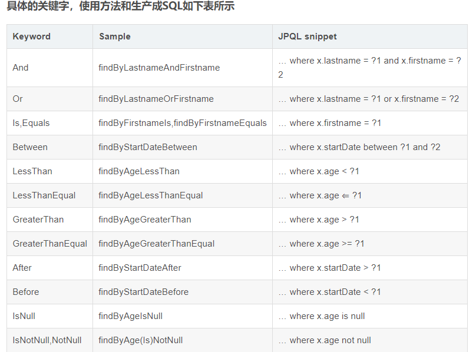
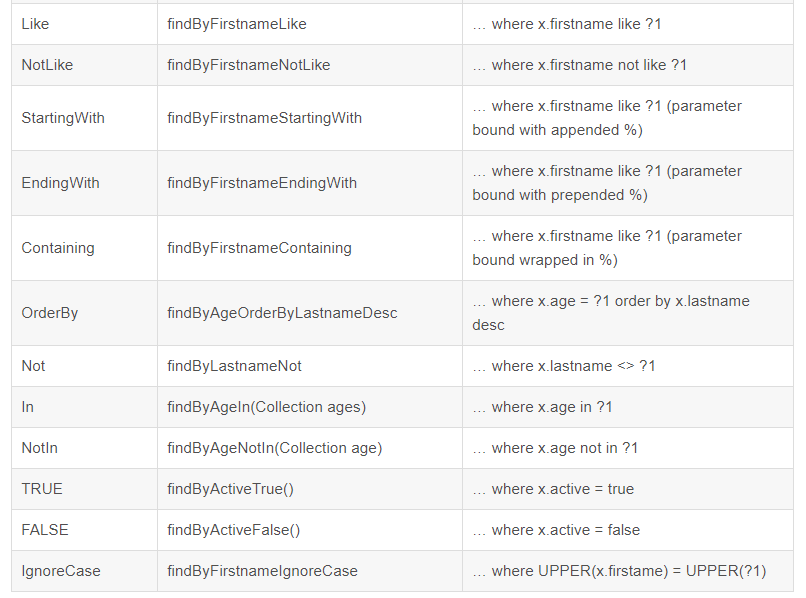

# Spring-data-jpa
在实际开发过程中，对数据库的操作无非就“增删改查”。就最为普遍的单表操作而言，除了表和字段不同外，语句都是类似的，开发人员需要写大量类似而枯燥的语句来完成业务逻辑。
为了解决这些大量枯燥的数据操作语句，我们第一个想到的是使用ORM框架，比如：Hibernate。通过整合Hibernate之后，我们以操作Java实体的方式最终将数据改变映射到数据库表中。
    
为了解决抽象各个Java实体基本的“增删改查”操作，我们通常会以泛型的方式封装一个模板Dao来进行抽象简化，但是这样依然不是很方便，我们需要针对每个实体编写一个继承自泛型模板Dao的接口，再编写该接口的实现。虽然一些基础的数据访问已经可以得到很好的复用，但是在代码结构上针对每个实体都会有一堆Dao的接口和实现。
    
由于模板Dao的实现，使得这些具体实体的Dao层已经变的非常“薄”，有一些具体实体的Dao实现可能完全就是对模板Dao的简单代理，并且往往这样的实现类可能会出现在很多实体上。Spring-data-jpa的出现正可以让这样一个已经很“薄”的数据访问层变成只是一层接口的编写方式。
    
## 引入spring-boot-starter-data-jpa
    
```
<dependency>
    <groupId>org.springframework.boot</groupId>
    <artifactId>spring-boot-starter-data-jpa</artifactId>
</dependency>
```
    
## 配置数据源和hibernate

```
spring.datasource.url=jdbc:mysql://localhost:3306/test
spring.datasource.username=root
spring.datasource.password=root
spring.datasource.driver-class-name=com.mysql.jdbc.Driver

spring.jpa.properties.hibernate.hbm2ddl.auto=update
spring.jpa.properties.hibernate.show_sql=true
spring.jpa.properties.hibernate.format_sql=true
# mysql生成表时使用的引擎，默认是MyISAM
spring.jpa.database-platform=org.hibernate.dialect.MySQL5InnoDBDialect
```
    
Spring-data-jpa依赖于Hibernate，`spring.jpa.properties.hibernate.hbm2ddl.auto`是hibernate的配置属性，其主要作用是：自动创建、更新、验证数据库表结构。该参数的几种配置如下：
    
- `create`：每次加载hibernate时都会删除上一次的生成的表，然后根据你的model类再重新来生成新表，哪怕两次没有任何改变也要这样执行，这就是导致数据库表数据丢失的一个重要原因。
- `create-drop`：每次加载hibernate时根据model类生成表，但是sessionFactory一关闭,表就自动删除。
- `update`：最常用的属性，第一次加载hibernate时根据model类会自动建立起表的结构（前提是先建立好数据库），以后加载hibernate时根据model类自动更新表结构，即使表结构改变了但表中的行仍然存在不会删除以前的行。要注意的是当部署到服务器后，表结构是不会被马上建立起来的，是要等应用第一次运行起来后才会。
- `validate`：每次加载hibernate时，验证创建数据库表结构，只会和数据库中的表进行比较，不会创建新表，但是会插入新值。
    

## 创建实体
创建一个User实体，包含id（主键）、username（用户名）、password（密码）属性，通过ORM框架其会被映射到数据库表中，由于配置了`hibernate.hbm2ddl.auto`，在应用启动的时候框架会自动去数据库中创建对应的表。
   
```
@Entity
@Table(name = "users")
public class User implements Serializable {

    private static final long serialVersionUID = 1L;

    @Id
    @GeneratedValue(strategy = GenerationType.IDENTITY)
    private Long id;
    @Column(nullable = false)
    private String username;
    @Column(nullable = false)
    private String password;

    // 省略getter和setter
}
```
    

## 创建数据访问接口
    
```
public interface UserRepository extends JpaRepository<User, Long> {

    User findByUsername(String username);
    
    User findByUsernameAndPassword(String username, String password);
    
    @Query("from User u where u.username=:name")
    User findUser(@Param("name") String username);
    
    @Query(value="select * from user where password=:pass", nativeQuery = true)
    List<User> findByPassword(@Param("pass") String password);
    
    @Modifying
    @Query(value="update user set username=:name where id=:id", nativeQuery = true)
    int update(@Param("id") long id, @Param("name") String username);
}
```
    
该接口继承自`JpaRepository`，通过查看`JpaRepository`接口的API文档，可以看到该接口本身已经实现了创建（`save`）、更新（`save`）、删除（`delete`）、查询（`findAll`、`findOne`）等基本操作的函数，因此对于这些基础操作的数据访问就不需要开发者再自己定义。
    

## 解析方法名创建查询
在我们实际开发中，`JpaRepository`接口定义的接口往往还不够或者性能不够优化，我们需要进一步实现更复杂一些的查询或操作。
    
在上例中，我们可以看到下面两个函数：
    
```
    User findByUsername(String username);
    User findByUsernameAndPassword(String username, String password);
```
   
它们分别实现了按username查询User实体和按username和password查询User实体，可以看到我们这里没有任何类SQL语句就完成了两个条件查询方法。这就是Spring-data-jpa的一大特性：**解析方法名创建查询**。
    
除了通过解析方法名来创建查询外，它也提供通过使用`@Query` 注解来创建查询，您只需要编写JPQL语句，并通过类似`:name`来映射`@Param`指定的参数，就像例子中的第三个`findUser`函数一样。`nativeQuery=true`表示使用的是原生sql。更新操作需要标识 `@Modifying`。
   
  
    
  
    

## 简单分页
简单分页可直接调用接口`Page<T> findAll(Pageable pageable)`获取分页结果。
    
```
public Page<User> findAll(Integer page, Integer size) {
    Pageable pageable = PageRequest.of(page, size, Sort.Direction.DESC, "id");
    return repository.findAll(pageable);
}
```
    

## 带查询条件的分页
带查询条件的分页需要继承 `JpaSpecificationExecutor<T>`接口，实现参数的`Predicate`组合查询。
    
```
public Page<User> findAll(Integer page, Integer size, final QueryParam param) {

    Pageable pageable = PageRequest.of(page, size, Sort.Direction.DESC, "id"); 
    return repository.findAll(new Specification<User>() {

        @Override
        public Predicate toPredicate(Root<User> root, CriteriaQuery<?> query, CriteriaBuilder criteriaBuilder) {
            List<Predicate> list = new ArrayList<>();
            if (!StringUtils.isEmpty(param.getUsername())) {
                list.add(criteriaBuilder.equal(root.get("username").as(String.class), param.getUsername()));
            }
            if (!StringUtils.isEmpty(param.getPassword())) {
                list.add(criteriaBuilder.equal(root.get("password").as(String.class), param.getPassword()));
            }
            Predicate[] predicates = new Predicate[list.size()];
            return criteriaBuilder.and(list.toArray(predicates));
        }}, pageable);
}
```