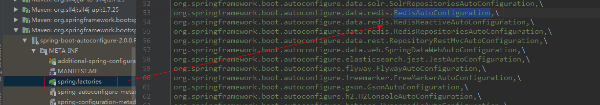

# springboot 自动配置原理
`@SpringBootApplication`有很多的注解组成，重要的只有三个Annotation：
- `@Configuration` 代表了一个配置类，相当于一个beans.xml文件。
- `@ComponentScan` 自动扫描并加载符合条件的组件或bean定义，最终将这些bean定义加载到容器中。默认扫描当前目录及子目录。
- `@EnableAutoConfiguration` 在spring中@Enablexxx的注解是开启某一项功能的注解，`@EnableAutoConfiguration`代表开启springboot的自动装配。
    
## @EnableAutoConfiguration自动装配
```
@Target(ElementType.TYPE)
@Retention(RetentionPolicy.RUNTIME)
@Documented
@Inherited
@AutoConfigurationPackage
@Import(AutoConfigurationImportSelector.class)
public @interface EnableAutoConfiguration {
    String ENABLED_OVERRIDE_PROPERTY = "spring.boot.enableautoconfiguration";
    // 按类型排除不需要自动装配的类
    Class<?>[] exclude() default {};
    // 按名称排除不需要自动装配的类
    String[] excludeName() default {};
}
```
    
从源码中可以知道，最关键的要属`@Import(EnableAutoConfigurationImportSelector.class)`，借助`EnableAutoConfigurationImportSelector`，`@EnableAutoConfiguration`可以帮助SpringBoot应用将所有符合条件的`@Configuration`配置类都加载到当前SpringBoot创建的Ioc容器中。同时借助工具类：`SpringFactoriesLoader`，`@EnableAutoConfiguration`就可以实现智能的自动配置。
    
```
//从这里可以看出该类实现很多的xxxAware和DeferredImportSelector，所有的aware都优先于selectImports方法执行，
//也就是说selectImports方法最后执行，那么在它执行的时候所有需要的资源都已经获取到了。
public class AutoConfigurationImportSelector implements DeferredImportSelector, BeanClassLoaderAware, 
    ResourceLoaderAware, BeanFactoryAware, EnvironmentAware, Ordered {

    public String[] selectImports(AnnotationMetadata annotationMetadata) {
        if (!this.isEnabled(annotationMetadata)) {
            return NO_IMPORTS;
        } else {
            // 1. 加载META-INF/spring-autoconfigure-metadata.properties文件
            AutoConfigurationMetadata autoConfigurationMetadata = AutoConfigurationMetadataLoader.loadMetadata(this.beanClassLoader);
            // 2. 获取注解的属性及其值（PS：注解指的是@EnableAutoConfiguration注解）
            AnnotationAttributes attributes = this.getAttributes(annotationMetadata);
            // 3. 在classpath下所有的META-INF/spring.factories文件中查找org.springframework.boot.autoconfigure.EnableAutoConfiguration的值，并将其封装到一个List中返回
            List<String> configurations = this.getCandidateConfigurations(annotationMetadata, attributes);
            // 4. 对上一步返回的List中的元素去重、排序
            configurations = this.removeDuplicates(configurations);
            // 5. 依据第2步中获取的属性值排除一些特定的类(exclude属性)
            Set<String> exclusions = this.getExclusions(annotationMetadata, attributes);
            // 6. 对上一步中所得到的List进行过滤，过滤的依据是条件匹配。这里用到的过滤器是
            //    org.springframework.boot.autoconfigure.condition.OnClassCondition最终返回的是一个ConditionOutcome[]数组。
            //    PS：很多类都是依赖于其它的类的，当classpath下有某个类时才会装配，所以这次过滤的就是根据是否有某个
            //    class进而决定是否装配的。这些类所依赖的类都写在META-INF/spring-autoconfigure-metadata.properties文件里。
            this.checkExcludedClasses(configurations, exclusions);
            configurations.removeAll(exclusions);
            configurations = this.filter(configurations, autoConfigurationMetadata);
            this.fireAutoConfigurationImportEvents(configurations, exclusions);
            return StringUtils.toStringArray(configurations);
        }
    }
    
    protected List<String> getCandidateConfigurations(AnnotationMetadata metadata, AnnotationAttributes attributes) {
        // 读取`META-INF/spring.factories`文件下的配置项
        List<String> configurations = SpringFactoriesLoader.loadFactoryNames(
            this.getSpringFactoriesLoaderFactoryClass(), this.getBeanClassLoader());
        Assert.notEmpty(configurations, "No auto configuration classes found in META-INF/spring.factories. If you are using a custom packaging, make sure that file is correct.");
        return configurations;
    }

    ...
}
```
    
## SpringFactoriesLoader 加载配置类
`SpringFactoriesLoader`属于Spring框架私有的一种扩展方案，其主要功能就是从指定的配置文件`META-INF/spring.factories`加载配置，即根据`@EnableAutoConfiguration`的完整类名`org.springframework.boot.autoconfigure.EnableAutoConfiguration`作为查找的Key，获取对应的一组`@Configuration`类。
    
```
public abstract class SpringFactoriesLoader {
    public static final String FACTORIES_RESOURCE_LOCATION = "META-INF/spring.factories";
    private static Map<String, List<String>> loadSpringFactories(@Nullable ClassLoader classLoader) {
        MultiValueMap<String, String> result = cache.get(classLoader);
        if (result != null)
            return result;
        try {
            Enumeration<URL> urls = (classLoader != null ?
                    classLoader.getResources(FACTORIES_RESOURCE_LOCATION) :
                    ClassLoader.getSystemResources(FACTORIES_RESOURCE_LOCATION));
            result = new LinkedMultiValueMap<>();
            while (urls.hasMoreElements()) {
                URL url = urls.nextElement();
                UrlResource resource = new UrlResource(url);
                Properties properties = PropertiesLoaderUtils.loadProperties(resource);
                for (Map.Entry<?, ?> entry : properties.entrySet()) {
                    List<String> factoryClassNames = Arrays.asList(
                            StringUtils.commaDelimitedListToStringArray((String) entry.getValue()));
                    result.addAll((String) entry.getKey(), factoryClassNames);
                }
            }
            cache.put(classLoader, result);
            return result;
        }
        catch (IOException ex) {
            throw new IllegalArgumentException("Unable to load factories from location [" +
                    FACTORIES_RESOURCE_LOCATION + "]", ex);
        }
    }
    
    ...
```
    
**总结**：`@EnableAutoConfiguration`作用就是从classpath中搜寻所有的`META-INF/spring.factories`配置文件，并将其中`org.springframework.boot.autoconfigure.EnableutoConfiguration`对应的配置项通过反射（Java Refletion）实例化为对应的标注了@Configuration的JavaConfig形式的IoC容器配置类，然后加载到IoC容器。这些功能配置类要生效的话，会去classpath中找是否有该类的依赖类（也就是pom.xml必须有对应功能的jar包才行）并且配置类里面注入了默认属性值类，功能类可以引用并赋默认值。生成功能类的原则是自定义优先，没有自定义时才会使用自动装配类。
    
所以功能类能生效需要的条件：
- `spring.factories` 里面有这个类的配置类（一个配置类可以创建多个围绕该功能的依赖类）
- `pom.xml` 里面需要有对应的jar包
    

# Redis 自动配置案例说明

1. 从`spring-boot-autoconfigure.jar/META-INF/spring.factories`中获取redis的相关配置类全限定名`RedisAutoConfiguration`，一般一个功能配置类围绕该功能，负责管理创建多个相关的功能类，比如`RedisAutoConfiguration`负责：`JedisConnectionFactory`、`RedisTemplate`、`StringRedisTemplate`这3个功能类的创建。
    
  
    
2. `RedisAutoConfiguration`配置类生效的条件是在classpath路径下有`RedisOperations`类存在，因此springboot的自动装配机制会会去classpath下去查找对应的class文件。
    
```
@Configuration
@ConditionalOnClass(RedisOperations.class)
@EnableConfigurationProperties(RedisProperties.class)
@Import({ LettuceConnectionConfiguration.class, JedisConnectionConfiguration.class })
public class RedisAutoConfiguration {
    ...
}
```
    
3. 如果pom.xml有对应的jar包,就能匹配到对应依赖class。
    
```
<dependency>
    <groupId>org.springframework.boot</groupId>
    <artifactId>spring-boot-starter-data-redis</artifactId>
</dependency>
```
    
4. 匹配成功，这个功能配置类才会生效，同时会注入默认的属性配置类`@EnableConfigurationProperties(RedisProperties.class)`，通过`@ConfigurationProperties`注入properties配置文件中以`spring.redis`开头的配置项。
    
```
@ConfigurationProperties(prefix = "spring.redis")
public class RedisProperties {
    private int database = 0;
    private String url;
    private String host = "localhost";
    private String password;
    private int port = 6379;
    ...
}
```
    
5. `JedisConnectionConfiguration`会根据条件生成最终的`JedisConnectionFactory`，`RedisAutoConfiguration`依赖`JedisConnectionFactory`生成`RedisTemplate`，并提供了默认的配置形式`@ConditionalOnMissingBean(name = "redisTemplate")`。
    
```
@Configuration
@ConditionalOnClass(RedisOperations.class)
@EnableConfigurationProperties(RedisProperties.class)
@Import({ LettuceConnectionConfiguration.class, JedisConnectionConfiguration.class })
public class RedisAutoConfiguration {

    @Bean
    //用户没定义就使用默认的
    @ConditionalOnMissingBean(name = "redisTemplate")
    public RedisTemplate<Object, Object> redisTemplate(
            RedisConnectionFactory redisConnectionFactory) throws UnknownHostException {
        RedisTemplate<Object, Object> template = new RedisTemplate<>();
        template.setConnectionFactory(redisConnectionFactory);
        return template;
    }

    @Bean
    @ConditionalOnMissingBean(StringRedisTemplate.class)
    public StringRedisTemplate stringRedisTemplate(
            RedisConnectionFactory redisConnectionFactory) throws UnknownHostException {
        StringRedisTemplate template = new StringRedisTemplate();
        template.setConnectionFactory(redisConnectionFactory);
        return template;
    }
}
```
    
6. 最终创建好的默认装配类，会通过功能配置类里面的 @Bean注解，注入到IOC容器中。
    

## 常见的条件依赖注解
- `@ConditionalOnBean` 仅在当前上下文(Ioc容器)中存在某个bean时，才会实例化这个类。

- `@ConditionalOnClass` 某个class位于类路径上，才会实例化这个类。

- `@ConditionalOnSingleCandidate` 只有一个候选或者多个候选时存在@Primary修饰的bean，才会实例化这个类。

- `@ConditionalOnMissingBean` 仅在当前上下文(Ioc容器)中不存在某个bean时，才会实例化这个类。

- `@ConditionalOnMissingClass` 某个class在类路径上不存在的时候，才会实例化这个类。

- `@ConditionalOnNotWebApplication` 不是web应用时才会实例化这个类。

- `@AutoConfigureAfter` 在某个类完成自动配置后实例化这个类。

- `@AutoConfigureBefore` 在某个类完成自动配置前实例化这个类。
    

## spring-boot-starter
spring-boot-starter-xxx是官方提供的starter，xxx-spring-boot-starter是第三方提供的starter。
    

