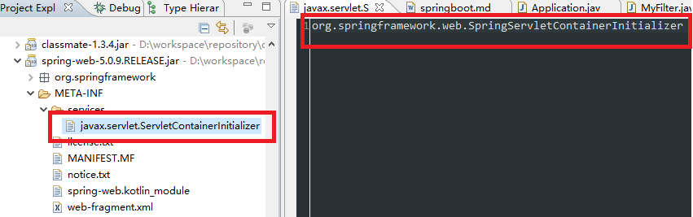

# SpringBoot
Spring Boot让我们的Spring应用变的更轻量化。我们不必像以前那样繁琐的构建项目、打包应用、部署到Tomcat等应用服务器中来运行我们的业务服务。通过Spring Boot实现的服务，只需要依靠一个Java类，把它打包成jar，并通过java -jar命令就可以运行起来。这一切相较于传统Spring应用来说，已经变得非常的轻便、简单。
    
Spring Boot的主要优点：

- 为所有Spring开发者更快的入门
- 开箱即用，提供各种默认配置来简化项目配置
- 内嵌式容器简化Web项目
- 没有冗余代码生成和XML配置的要求
    

## SpringBoot核心模块
`spring-boot-starter`：核心模块，包括自动配置支持、日志和YAML
`spring-boot-starter-web`：SpringMvc web模块，包含内置的tomcat容器
`spring-boot-starter-test`：测试模块，包括JUnit、Hamcrest、Mockito
    

## 快速构建Maven项目
1. 使用Spring Initializr页面创建项目
    - 访问Spring Initializr：`https://start.spring.io/`
    - 选择构建工具Maven Project、Spring Boot版本、工程基本信息以及需要依赖的组件
    - 点击Generate Project下载项目压缩包
    
2. 解压项目包，并用IDE以Maven项目导入
    - `src/main/java`: java 类目录
    - `src/main/resources`: 配置文件和资源文件目录，资源文件包括静态文件和META-INF下的web文件
    - `src/test`: 测试目录
    

## banner
springboot启动时的横幅显示信息可以通过resources/banner.txt进行自定义。
    

## WebApplicationInitializer
`WebApplicationInitializer`的作用就是用来替代web开发中最重要的web.xml文件。
    
servlet3.0 使用spi提供了自动加载的接口，不需要在web.xml中配置。servlet3.0 规范中通过`ServletContainerInitializer`在web容器启动时为第三方组件提供了做初始化的工作的机会，例如注册servlet或者filter等。每个框架要使用`ServletContainerInitializer`就必须在对应的jar包的`META-INF/services`目录下创建一个名为`javax.servlet.ServletContainerInitializer`的文件，文件内容指定具体的`ServletContainerInitializer`实现类。配合`HandlesTypes注解`可以将感兴趣的类注入到`ServletContainerInitializer`的onStartup方法作为参数传入。
    
`SpringServletContainerInitializer`类实现了`ServletContainerInitializer`接口来提供`WebApplicationInitializer`应用初始化入口。`WebApplicationInitializer`目前只对常规容器(WEB-INF/lib)部署有效，通过内置容器启动的服务无法加载。
    

```
@HandlesTypes(WebApplicationInitializer.class)
public class SpringServletContainerInitializer implements ServletContainerInitializer {

    @Override
    public void onStartup(@Nullable Set<Class<?>> webAppInitializerClasses, ServletContext servletContext)
            throws ServletException {

        List<WebApplicationInitializer> initializers = new LinkedList<>();

        if (webAppInitializerClasses != null) {
            for (Class<?> waiClass : webAppInitializerClasses) {
                // Be defensive: Some servlet containers provide us with invalid classes,
                // no matter what @HandlesTypes says...
                if (!waiClass.isInterface() && !Modifier.isAbstract(waiClass.getModifiers()) &&
                        WebApplicationInitializer.class.isAssignableFrom(waiClass)) {
                    try {
                        initializers.add((WebApplicationInitializer)
                                ReflectionUtils.accessibleConstructor(waiClass).newInstance());
                    }
                    catch (Throwable ex) {
                        throw new ServletException("Failed to instantiate WebApplicationInitializer class", ex);
                    }
                }
            }
        }

        if (initializers.isEmpty()) {
            servletContext.log("No Spring WebApplicationInitializer types detected on classpath");
            return;
        }

        servletContext.log(initializers.size() + " Spring WebApplicationInitializers detected on classpath");
        AnnotationAwareOrderComparator.sort(initializers);
        for (WebApplicationInitializer initializer : initializers) {
            initializer.onStartup(servletContext);
        }
    }
}
```
    
  
    

## SpringBootServletInitializer
`SpringBootServletInitializer`是个抽象类，实现了`WebApplicationInitializer `接口，一般想要将Springboot部署到tomcat等web容器里的时候，都会继承类`SpringBootServletInitializer`，在这个类的onStartup方法中，启动了整个Spring容器。需要覆盖configure方法加载应用入口`builder.sources(Application.class)`，


